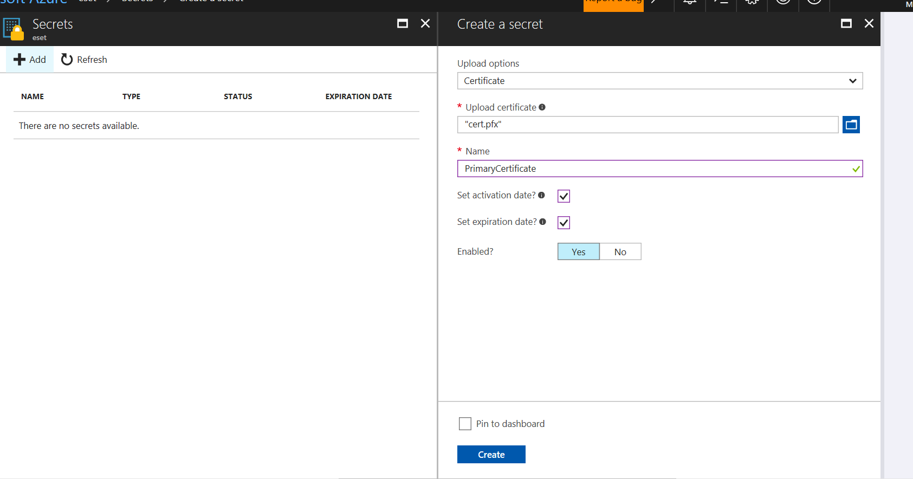
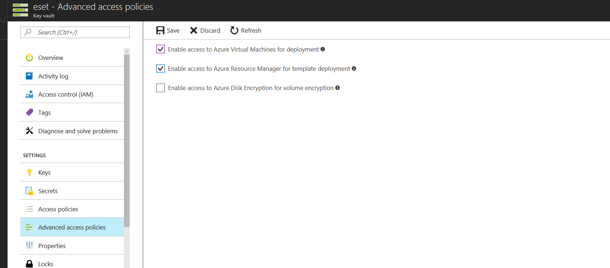
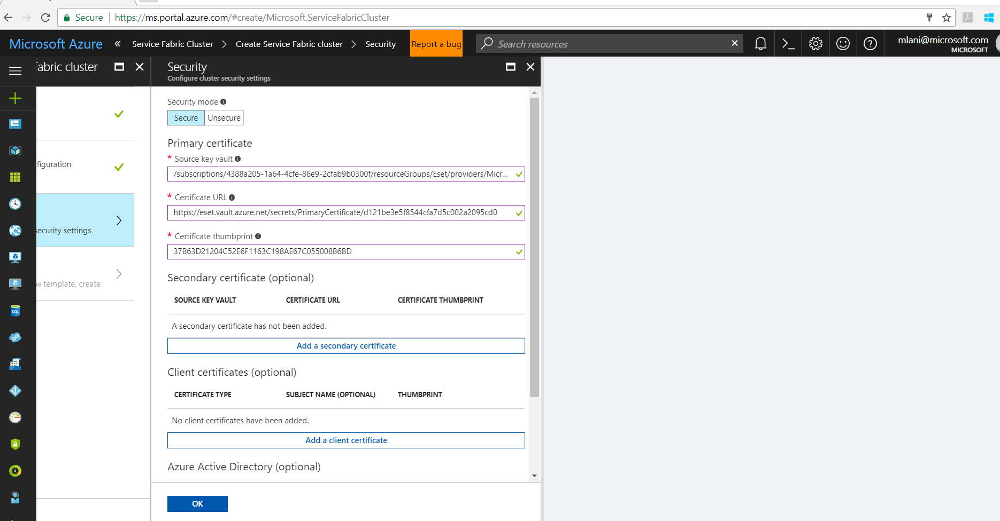

# JJ Azure ServiceFabric sample
This repo contains ServiceFabric samples with several services:

## Encrypted service JJFabric.EncryptedSvcApi
This service implements how to encrypt secrets in ServiceFabric. Api service returns encrypted value from encrypted secret stored in fabric configuration.
ServiceFabric documentation (https://docs.microsoft.com/en-us/azure/service-fabric/service-fabric-application-secret-management)

### Step 1 - Create certificate
Creating self-signed certificate for demo. Check with certmgr.msc certificate has been created.
```PowerShell
.\Scripts\prepare.ps1
```
Or you can use certificate stored in Scripts folder, simply insert it in Computer Certificate Store (MMC Manage Computer Certificates).

### Step 2 - Encrypt value "mojeheslo"
```PowerShell
.\Scripts\encrypt.ps1
```

### Step 3 - Add secret into fabric code
Add secret into service settings file, change value with encrypted value
```Xml
  <Section Name="JJConfigSection">
    <Parameter Name="JJHeslo" IsEncrypted="true"  Value="MIIBrwYJKoZIhvcNAQcDoIIBoDCCAZwCAQAxggFHMIIBQwIBADArMBcxFTATBgNVBAMMDGpqZmFicmljY2VydAIQZPR+6QCuwYJF2S0dq0BOfDANBgkqhkiG9w0BAQcwAASCAQBL2/uRa3Roup5ycfURdQHoh3faTjmW/0WID7UK0+NsQTbzEAeO6PGRn+FZ/ZLNSZOv8S2kprznQrNQdnkP18EFo7B0J/SZsHEsLGOxu2qYv061JhnI5DPYU3EwpXXxGSaSMLfAF8j++Ta+68jXejv9V1Cm+0R0Du2PEBZVtDELcb1oHR4Yel3gVxWJTbpUEEmM6iniI1SDUfwGEExP1WOQLnwImnGAG1GOWT3Yd52URkJ6c8hIvGwg3QwGcObeq5Brf05djhuqhZoQf5PgiEDsLuKUY56IAgEEVGyODTqt/fzDJI5INZNygPbU0iaeaQof+unWglZkGMpqFKfbPCvqMEwGCSqGSIb3DQEHATAdBglghkgBZQMEASoEEKuQrcetGQ9S4icdCAXPuK2AINyGXAqSsc22bUMHwDfOKmWW9v/uUMwX7NjHLvjlGIiU" />
  </Section>
```
btw, you can override this value durring application deployment process -> define in ApplicationManifest ConfigOverrides

Next, add thumbprint into ApplicationManifest.xml
```Xml
  <Principals>
    <Users>
      <User Name="EncryptedSvcApi" AccountType="NetworkService" />
    </Users>
  </Principals>
  <Policies>
    <SecurityAccessPolicies>
      <SecurityAccessPolicy GrantRights="Read" PrincipalRef="EncryptedSvcApi" ResourceRef="EncryptedSvcApiCert" ResourceType="Certificate"/>
    </SecurityAccessPolicies>
  </Policies>
  <Certificates>
    <SecretsCertificate Name="EncryptedSvcApiCert" X509FindType="FindByThumbprint" X509FindValue="37B63D21204C52E6F1163C198AE67C055008B6BD"/>
  </Certificates>
```

### Step 4 - Test locally
Open Visual Studio project and deploy into local ServiceFabric.
Check port in ServiceManifest.xml and start browser (http://localhost:8247/api/values/5)


## Service Fabric Configuration Provider for Stateless .NET Core service

We have implemented custom configuration provider which allows us to read configuration variables (in this case decrypt encrypted secret) from service settings file. This has been implemented in following way:

#### Step1 - Create and add custom configuration provider to the configuration builder

In order to use custom config provider we have implemented following artefacts:

**ServiceFabricConfigurationProvider** - configuration provider for ASP.NET Core that retrieves setting from the Service Fabric configuration

**ServiceFabricConfigurationSource** - In order to add provider to the configuration builder we also need to implement a configuration source

**AddServiceFabricConfiguration** - extension method which enables us to build our configuration

For more details please see:  https://dzimchuk.net/configuring-asp-net-core-applications-in-service-fabric/ 


```c#
internal class ServiceFabricConfigurationProvider : ConfigurationProvider
    {
        private readonly ServiceContext serviceContext;

        public ServiceFabricConfigurationProvider(ServiceContext serviceContext)
        {
            this.serviceContext = serviceContext;
        }

        public override void Load()
        {
            var config = serviceContext.CodePackageActivationContext.GetConfigurationPackageObject("Config");
            foreach (var section in config.Settings.Sections)
            {
                foreach (var parameter in section.Parameters)
                {
                    //For the purpose of demo we assume that the parameter is encrypted
                    SecureString jjHeslo = parameter.DecryptValue();
                    Data[$"{section.Name}{ConfigurationPath.KeyDelimiter}{parameter.Name}"] = Common.Common.SecureStringToString(jjHeslo);
                }
            }
        }
    }

    internal class ServiceFabricConfigurationSource : IConfigurationSource
    {
        private readonly ServiceContext serviceContext;

        public ServiceFabricConfigurationSource(ServiceContext serviceContext)
        {
            this.serviceContext = serviceContext;
        }

        public IConfigurationProvider Build(IConfigurationBuilder builder)
        {
            return new ServiceFabricConfigurationProvider(serviceContext);
        }
    }

    public static class ServiceFabricConfigurationExtensions
    {
        public static IConfigurationBuilder AddServiceFabricConfiguration(this IConfigurationBuilder builder, ServiceContext serviceContext)
        {
            builder.Add(new ServiceFabricConfigurationSource(serviceContext));
            return builder;
        }
    }
```

Implementation of above mentioned classes and method can be found in ServiceFabricConfiguration.cs file


#### Step 2 - Modify Startup.cs to use custom config provider

Inject StatelessServiceContext serviceContext parameter

AddServiceFabricConfiguration - extension that adds a  custom configuration provider that reads from Service Fabric configuration packages as explained

```c#
 public Startup(IHostingEnvironment env, StatelessServiceContext serviceContext)
 {
   var builder = new ConfigurationBuilder()
     .AddServiceFabricConfiguration(serviceContext)
     .SetBasePath(env.ContentRootPath)
     .AddJsonFile("appsettings.json", optional: false, reloadOnChange: true)
     .AddJsonFile($"appsettings.{env.EnvironmentName}.json", optional: true)         
     .AddEnvironmentVariables();
   Configuration = builder.Build();
 }
```


#### Step 3 - Create Model/Entities classes that has properties that match the settings in a section in settings file

```C#
 public class JJConfigSettings
 {
   public string JJHeslo { get; set; }
 }
```

#### Step 4 - Register settings in Dependency Injection container 

```c#
public void ConfigureServices(IServiceCollection services)
{
    services.Configure<JJConfigSettings>(Configuration.GetSection("JJConfigSection"));
    
    // Add framework services.
    services.AddMvc();
}
```

#### Step 5 - Access settings section in WebAPI controller

```c#
[Route("api/[controller]")]
public class ValuesController : Controller
{
  private readonly IOptions<JJConfigSettings> _jjConfigSettings;
  public ValuesController(IOptions<JJConfigSettings> jjConfigSettings)
  {
 	 _jjConfigSettings = jjConfigSettings;
  }

  // GET api/values/5
  [HttpGet("{id}")]
  public string Get(int id)
  {
    return _jjConfigSettings.Value.JJHeslo;
  }
}
```


## Install certificate to Service Fabric Azure cluster (using Azure portal)

1. Setup KeyVault

2. Export certificate (together with private key) to pfx file

3. Create KeyVault secret:

   

4. Set Key Vault Access Policies for KeyVault

5. Create Service Fabric cluster, on cluster configuration blade do not forget to allow communication on custom endpoint (8247, that is where our API is listening)

6. Configure cluster security settings:

   - Source Key Vault (can be find in Properties of Key Vault in portal). Note: input is case-sensitive and sometime the value does not get copied correctly, please correct manually

   - Certificate-url: can be obtained thru key vault secret details

   - Certificate thumbprint: returned during generation of certificate

     